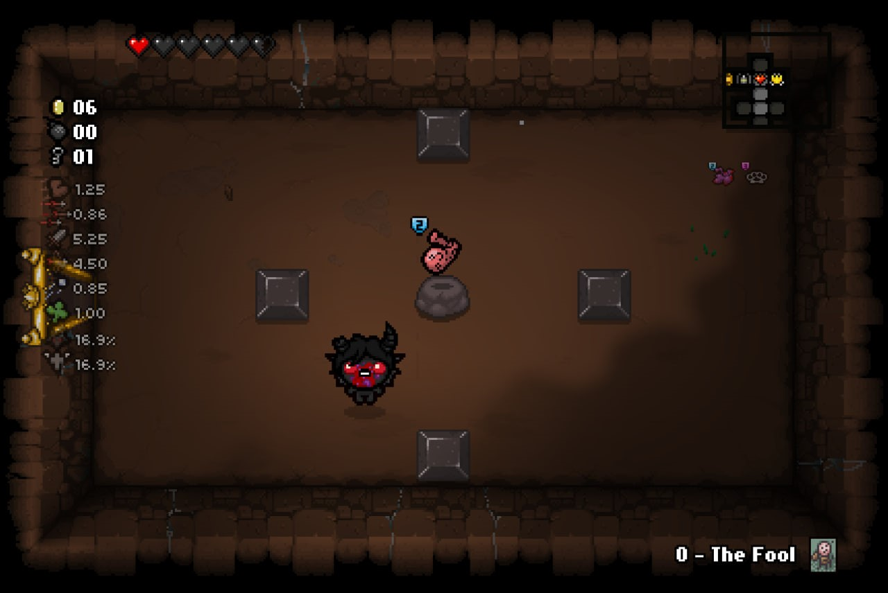

# The Binding of Isaac: Repentance mod that adds item quality to it's sprite

## Motivation
I wanted to have some info on items ingame on Nintеndo Switch. It's not possible to use any Lua based mods such as [External Item Desriptions](https://steamcommunity.com/sharedfiles/filedetails/?id=836319872) on that console.
## Info
This is only retexture mod that includes item quality icons from EID mod to texture of pickups. I've exluded `Negative`, `Polarod`, both `Knife pieces` and `Key pieces` and some items speciefic to tainted characters.
## Installation
Clone or download zip of this repository
### Swith
To install this mod you need to have modded Swith, you can find info how to mod your console on the Internet.
Copy `atmosphere` directory to the root of your SD card and merge it with existing. I recommend connecting SD card direcly to PC rather than using DBI MTP reponder (I wasn't able to copy all files using DBI)
### PC
Copy `qualityonsprites` directory to `mods` directory.
## Credits
Special thanks to EID developers for item quality icons.
## Contributing
If you find any missing items and/or errors on existing feel free to open issue on Github.